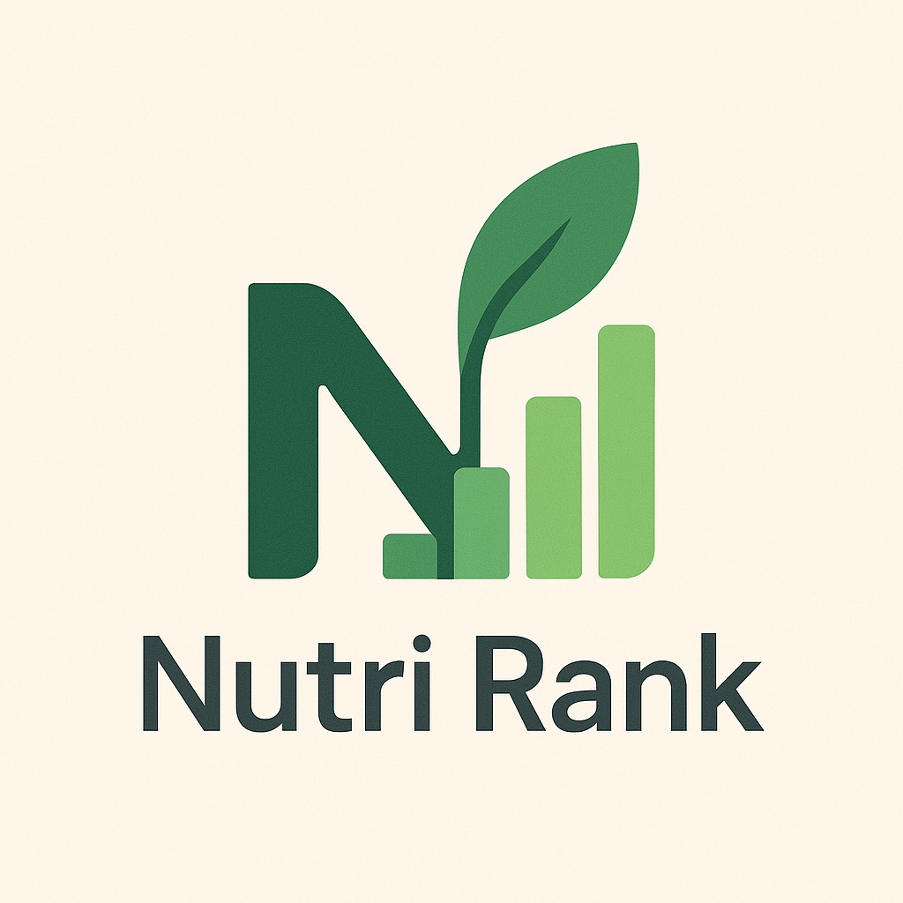

# Nutri-Score Based Nutrient Assessment and Recommendation Application

<div align="center">
  
  <br>
  <p>
    <a href="#overview">Overview</a> •
    <a href="#key-features">Key Features</a> •
    <a href="#system-architecture">Architecture</a> •
    <a href="#technology-stack">Tech Stack</a> •
    <a href="#implementation-status">Implementation Status</a> •
    <a href="#installation">Installation</a> •
    <a href="#usage">Usage</a> •
    <a href="#project-status">Status</a>
  </p>
</div>

## Overview

The Nutri-Score Based Nutrient Assessment and Recommendation Application empowers users to make healthier food choices by transforming complex nutritional information into an intuitive health score. The application integrates advanced barcode scanning and Optical Character Recognition (OCR) technologies to capture nutritional data from food products, retrieves detailed product information from the Open Food Facts API, and processes this data using a Nutri-Score–like algorithm.

The result is a clear, color-coded health score along with personalized recommendations for healthier alternatives, enabling users to quickly understand and compare the nutritional quality of food products while shopping.

## Key Features

- **User Authentication System**
    - Secure user registration and login via Firebase Authentication
    - Profile management with password update functionality

- **Advanced Data Acquisition**
    - Barcode scanning using Google ML Kit for quick product identification
    - OCR technology to extract nutritional information directly from packaging when barcodes aren't available

- **Comprehensive Nutritional Evaluation**
    - Nutri-Score calculation based on European standards
    - Detailed breakdown of nutritional values (calories, fats, carbohydrates, protein)
    - Historical tracking of scanned products

- **Smart Recommendations**
    - Personalized suggestions for healthier alternatives
    - Category-based product comparisons
    - Offline access to previously scanned product information

- **User-Friendly Interface**
    - Intuitive, clean design with color-coded indicators
    - Clear visual representation of nutritional quality
    - Seamless navigation between scanning, evaluation, and recommendations

## System Architecture

The application implements a clean, modular architecture designed for scalability, maintainability, and robust performance:

### Component Diagram
The application is structured into several key components organized in a layered architecture:

1. **UI Layer**
    - Activities and Fragments for user interaction
    - Dialogs for user feedback and notifications
    - Adapters for RecyclerView implementations

2. **Presentation Layer**
    - ViewModels that manage UI-related data and state
    - Implements MVVM architectural pattern

3. **Domain Layer**
    - Business Logic components including Nutri-Score calculation
    - Authentication management via Firebase
    - Camera and scanning components for barcode and OCR

4. **Data Layer**
    - Repository pattern for data access abstraction
    - Local database using Room/SQLite
    - Remote data sources including Open Food Facts API

5. **External Services**
    - Firebase Authentication
    - Google ML Kit for barcode scanning and OCR
    - Open Food Facts API integration

### Deployment Diagram
The deployment architecture shows how the system components are distributed:

- **User's Mobile Device**
    - NutriScan App (UI Layer, Business Logic, Data Access Layer)
    - Local Database (SQLite)
    - Device Sensors (Camera Hardware)

- **Cloud Services**
    - Firebase Services (Authentication, Firestore, Storage)
    - Open Food Facts API (Product Database, Search Engine)

## Technology Stack

- **Development Language**: Kotlin
- **Minimum SDK**: Android 8.0 (API 26)
- **Target SDK**: Android 15 (API 35)
- **Architecture**: MVVM with Repository pattern
- **UI Framework**: Android Jetpack Components
    - Navigation Component
    - Data Binding
    - ViewModel
    - LiveData
- **Database**:
    - Room/SQLite (local storage)
    - Firebase Firestore (cloud storage)
- **Authentication**: Firebase Authentication
- **Networking**: Retrofit with OkHttp and Gson converter
- **Image Processing**:
    - Google ML Kit for barcode scanning
    - Google ML Kit Text Recognition for OCR
- **Animation**: Lottie for UI animations
- **Image Loading**: Glide and GlideToVectorYou for SVG support

## Implementation Status

### Completed Features

- ✅ **User Authentication System**
    - User registration and login with email/password
    - Password update functionality
    - Profile management and session handling

- ✅ **User Interface**
    - Navigation system with bottom navigation
    - Welcome, login, and signup screens
    - Home dashboard with recent scans
    - Comprehensive product detail view
    - Error, success, and information dialogs with animations
    - Interactive tutorial dialogs for barcode and OCR scanning

- ✅ **Barcode Scanning**
    - Camera integration for barcode capture
    - Real-time barcode detection and processing
    - Flash toggle for low-light environments
    - Error handling with appropriate user feedback

- ✅ **OCR Integration**
    - Text recognition from product labels
    - Ingredient analysis and processing
    - Nutri-Score calculation from recognized ingredients
    - Camera controls with flash toggle

- ✅ **Nutri-Score Implementation**
    - Score calculation algorithm based on ingredients
    - Visual representation using official Nutri-Score graphics
    - Color-coded UI elements based on score

- ✅ **Data Management**
    - Local product storage using Room/SQLite
    - History management with view/delete functionality
    - Firestore integration for cloud backup

- ✅ **API Integration**
    - Open Food Facts API connection for product information
    - Product retrieval based on barcode
    - Error handling for network issues

- ✅ **Recommendation Engine Refinement**
    - Basic recommendation functionality implemented
    - Working on improving relevance and accuracy
    - Enhancing the display of recommended products

### In-Progress Features

- 🔄 **Offline Mode Enhancements**
    - Basic offline capability with local database
    - Implementing more robust network state handling
    - Improving synchronization when connection is restored

- 🔄 **Performance Optimizations**
    - Optimizing image processing for OCR
    - Improving database query performance
    - Reducing memory usage during scanning operations

### Planned Features

- 📅 **Advanced Filtering Options**
    - Filter recommendations based on dietary preferences
    - Allow sorting by various nutritional criteria

- 📅 **User Preferences**
    - Save dietary preferences and restrictions
    - Customize recommendation criteria

- 📅 **Enhanced Analytics**
    - Track nutritional trends from scan history
    - Provide insights on food consumption patterns

## Data Flow

When a user scans a product:

1. The scanning component (BarcodeCamera or OcrCamera) captures the data
2. The ViewModel processes the captured data
3. The Repository accesses local database or Open Food Facts API if needed
4. The Nutri-Score calculation is performed
5. The recommendation engine identifies healthier alternatives
6. Results are displayed to the user through the UI layer

## Package Structure

```
com.knbrgns.nutriscoreapp
├── MainActivity
├── camera
│   ├── BarcodeCamera
│   └── OcrCamera
├── data
│   ├── local
│   │   ├── converter
│   │   ├── dao
│   │   ├── database
│   │   └── entity
│   ├── remote
│   │   └── service
│   └── repository
├── firebaseAuth
│   └── FirebaseAuthHandler
├── model
│   ├── IngredientInfo
│   ├── Nutriments
│   ├── Product
│   ├── ProductResponse
│   └── User
├── ui
│   ├── adapter
│   ├── dialog
│   │   └── model
│   ├── fragment
│   ├── viewholder
│   └── viewmodel
└── utils
    ├── FirestoreUtils
    ├── NetworkMonitor
    ├── NutriScoreUtils
    ├── Resource
    └── ValidationUtils
```

## Installation

### Prerequisites
- Android Studio Iguana | 2023.2.1 or higher
- JDK 11 or higher
- An Android device or emulator running Android 8.0+
- Firebase account for authentication features

### For Developers

1. Clone the repository:
   ```bash
   git clone https://github.com/username/Nutri-Score-Based-Nutrient-Assessment-and-Recommendation-Application.git
   ```

2. Open the project in Android Studio

3. Configure Firebase:
    - Create a Firebase project in the Firebase Console
    - Add an Android app to your Firebase project
    - Download the `google-services.json` file and place it in the app/ directory
    - Enable Authentication (Email/Password) in Firebase Console
    - Set up Firestore Database with appropriate rules

4. Build the project:
   ```bash
   ./gradlew build
   ```

5. Run the application on an emulator or physical device.

## Usage

### User Registration and Authentication

1. Launch the application
2. Choose to sign up or sign in on the welcome screen
3. For account creation, provide email, password, and display name
4. Once authenticated, you'll be taken to the home screen

### Scanning Products

1. Navigate to the barcode tab using the bottom navigation
2. Point your camera at a product barcode
3. Allow the app to process the barcode and retrieve product information
4. If barcode scanning fails, use the OCR mode by tapping the OCR button
5. When using OCR, capture an image of the ingredient list
6. Review and edit the detected ingredients if necessary

### Viewing Product Details and Recommendations

1. After scanning a product, you'll see the product details screen
2. View the product's Nutri-Score and nutritional information
3. Browse through suggested healthier alternatives (if available)
4. Tap on a recommendation to view its details

### History and Dashboard

1. The home tab shows your recent scans with their Nutri-Scores
2. Access your complete scan history via the history tab
3. Delete individual items or clear your entire history
4. Learn more about the Nutri-Score system through the "Learn More" button

### Managing Your Profile

1. Access your profile through the profile button in the top right
2. Update your password by providing your current and new passwords
3. Log out when finished

## Database Schema

The application utilizes both Room/SQLite (local) and Firebase (cloud) databases with the following schema:

### Local Database (Room/SQLite)

```
Product
├── barcodeID (PRIMARY KEY): TEXT
├── product_name: TEXT
├── nutri_score: TEXT
├── nutri_score_value: INTEGER
├── brands: TEXT
├── categories_tags: List<String>
├── image_url: TEXT
├── created_datetime: TEXT
└── is_recommendation: BOOLEAN

Recommendation
├── id (PRIMARY KEY): INTEGER
├── product_barcode_id (FOREIGN KEY): TEXT
└── recommended_product_barcode_id (FOREIGN KEY): TEXT
```

## API Integration

The application integrates with the Open Food Facts API to retrieve comprehensive nutritional information for food products:

- **Base URL**: `https://world.openfoodfacts.org/`
- **Product Endpoint**: `api/v2/product/{barcode}.json`
- **Search Endpoint**: `cgi/search.pl`

## Project Status

Current Version: 0.9.0-beta

The project has implemented all core functionality and is currently in the beta testing phase. The following roadmap outlines upcoming enhancements:

### Short-term Roadmap

- Complete the recommendation engine refinement
- Enhance offline capabilities with better synchronization
- Optimize OCR processing for faster and more accurate results
- Add comprehensive error handling for edge cases
- Improve UI/UX based on user feedback

### Long-term Vision

- **Advanced Personalization**: Adapt recommendations based on user dietary preferences and restrictions
- **Multi-Language Support**: Expand beyond current language support
- **Gamification Elements**: Add achievement systems for healthy choices
- **Diet Tracking**: Integration with health and fitness applications

## Development Team

- **Enes Kanbur** (20soft1031) - Lead Developer
- **Talha Güneş** (20soft1019) - Developer & UI Design

## License

This project is licensed under the MIT License - see the LICENSE file for details.

## Acknowledgments

- Open Food Facts for providing the comprehensive food product database
- Google ML Kit for barcode scanning and OCR capabilities
- Firebase for authentication and cloud storage solutions
- The Nutri-Score initiative for establishing the nutritional scoring system

---

© 2025 Nutri-Score Application Team | COMP4902 Graduation Design Project
